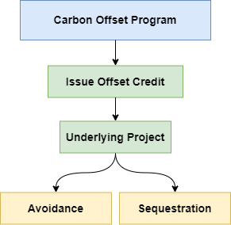
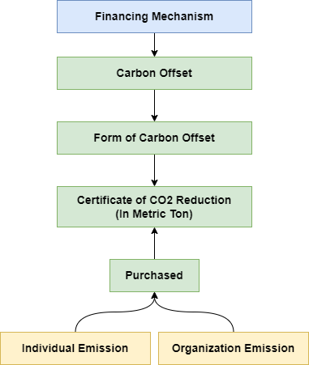

# Notes on Economics

# Perspective on Tokenomics

Financial interoperability requires a price stable means of value exchange. Creating possibilities in payments, lending, investing, trading and trade finance and the ecosystem will grow as other fiat currency tokens are added. As more goods and services are tokenized, smart contract platforms will become fundamental building blocks of value exchange.

# Digital Dollar (Stablecoin)

Unlike regular US dollars, Stablecoin as Digital Dollar doesn’t require a bank account. It doesn’t require that you live in a particular geography. You can send Stablecoin as Digital Dollar around the world at an extremely low cost in just a few minutes. Digital Dollar allows unbanked and under-banked individuals in any country to hold a US dollar–backed asset with nothing more than a mobile phone.

## Underlying & Transparency

Stablecoin is backed by dollar denominated assets of at least equal fair value to the the stablecoin in circulation, in segregated accounts with US regulated financial institutions. Such accounts are attested to (i.e. verified publicly) by an independent accounting firm. You can find example attestations on USDC [here](https://www.centre.io/usdc-transparency).

## Global Transaction

Stablecoin as Digital Dollar is designed to let dollars move globally from your crypto wallet to other exchanges, businesses, and people.

## Programmable Dollar

Being programmable unlocks a whole new world of applications and businesses: developers can create accounts to store money with one line of code; lending that is faster, cheaper, and more transparent; faster and cheaper payments, including payroll; global crowdfunding; transparent and stable donations to charity.

## USDC

USDC is the brainchild of CENTRE, an open source technology project bootstrapped by contributions from Circle and Coinbase. This organization will be responsible for governing USDC and is dedicated to connecting every person, merchant, financial institution and currency, everywhere. [Learn more about CENTRE.](https://www.centre.io/usdc)

----

# Macroeconomy

The secret sauce for US growth has been that we’ve had strong population growth and strong gains in the labor force. One of the reasons the US economy has outperformed the economies of other developed nations for the last 30 or 40 years has been that we’ve had faster labor force growth. 

It’s a very simple arithmetic equation: More workers, more GDP.

US have been very dependent on immigration. That’s not new. This has been a nation of immigrants since its founding. If US not viewed as welcoming to talent from around the world, US have a problem going forward in terms of long-term growth.

When we look at the information from individual companies and industries, we see that there is a labor shortage at all ends. We all know, for example, that right now one of the reasons behind the rise in service inflation has to do with an inadequate number of workers at airports, in hotels, in restaurants and so on. 

Many economists, myself included, believe the so-called golden era of the 1950s, 1960s US economy was linked to our willingness to invest heavily in the future. 

# Food Security

Russia was a gigantic exporter of wheat. This is the basic food ingredient that keeps people from rioting. There’s a possibility this leads to revolution in populations that do not have control over their food and energy.

---

# Carbon

| Parameter               | Value                                                        | Note |
| ----------------------- | ------------------------------------------------------------ | ---- |
| Carbon Stocks Watchlist | [Click Here](https://carboncredits.com/carbon-stocks-watchlist/) |      |
|                         |                                                              |      |
|                         |                                                              |      |

Every financial transaction has a climate consequence. Pretty much everything we buy has a carbon footprint. Our daily choices leave a carbon footprint. 

# Carbon Market

Carbon trading – or the carbon market – was first developed and introduced in the 1990s. In assigning a cost to the environmental damage of CO2 emissions, companies could, in theory, track and offset their own emissions. By purchasing carbon credits tied to ‘green projects’ in the marketplace, businesses across a range of industries could continue their practices while offsetting emissions and therefore reducing environmental damage. 

For example, a mining company subjected to an emissions limit could purchase an offset credit owned by a forest owner who could agree to use that money to delay or reduce a harvest. This would then allow the mining company to pollute above their set limit, and use the avoided forest emissions as credit. 

# Carbon Credit

**A Carbon Credit is an allowance for a company holding the credit to emit carbon emissions or greenhouse gases.** A single credit equals one ton of carbon dioxide to be emitted. Companies hold many credits, as many as they wish to purchase to balance out their emissions.

----

# Carbon Offset

**Carbon Offset Programs** issue credits to projects that purport to avoid greenhouse gas emissions or remove carbon dioxide from the atmosphere. 

For example, an oil refinery that is subject to an emissions limit might purchase an **offset credit** issued to a forest owner who agrees to reduce or delay a timber harvest. The refinery can then pollute more, claiming the avoided forest emissions as compensation.

**Offset Credit** is the idea is to pay for emission reductions elsewhere rather than invest in the country of operation.

The money you pay to buy offsets supports programs designed to reduce emissions. Those might include projects to develop renewable energy, capture methane from landfills or livestock, or distribute cleaner cooking stoves.

Reforestation increases biodiversity, and the installation of solar panels and wind turbines pulls energy demand away from coal and fossil fuel supplies.

A **Carbon offset** is a **certificate representing the reduction** of one metric ton (2,205 lbs) of carbon dioxide emissions, the principal cause of climate change. **Carbon offsets** compensate for your emissions by canceling out greenhouse gas emissions somewhere else in the world.  **Carbon offsets** are purchased to fund green projects and diminish the impact of your own GHG emissions, even though the projects are located elsewhere. 

There is no fixed price on carbon, and the cost of an offset varies from project to project, depending on how expensive it is to run a given program, said Sarah Leugers, director of communications at The Gold Standard. In general, though, carbon offsets probably cost less than you think.

If you develop a project that reduces carbon dioxide emissions, every ton of emissions reduced results in the creation of one carbon offset. Project developers can then sell these offsets to finance their projects. There are hundreds of different types of carbon reduction projects. For example, a dairy farm can install an anaerobic digester to capture and destroy methane that would otherwise be released when animal manure decomposes. However, such anaerobic digester projects are typically expensive to install and maintain. In order to finance the construction and operation of a digester project, a dairy farm can sell the emission reductions in the form of carbon offsets.

Carbon offsets are therefore an available tool for individuals and organizations that wish to mitigate the impact of their own carbon footprints.

## How are carbon offsets generated?

Emission reduction projects reduce the amount of greenhouse gases in the atmosphere in one of three ways:

1. By capturing and destroying a greenhouse gas that would otherwise be emitted into the atmosphere. An example of this is a methane gas capture project at a landfill.
2. By producing energy using a clean, renewable resource that eliminates the need to produce that same energy from fossil fuels, the burning of which releases greenhouse gas into the atmosphere. An example of this is wind power.
3. By capturing and storing (or “sequestering”) greenhouse gases to prevent their release into the atmosphere. An example of this is a project that promotes the healthy growth and maintenance of forests.

Some projects include more than one of these activities at the same time. For example, gas capture projects at landfills not only prevent the release of methane gas into the atmosphere, but they also use the captured methane to generate electricity that would otherwise be generated by burning fossil fuels such as coal or natural gas.

## Carbon Price

An[informal survey](https://www.weforum.org/agenda/2017/01/are-businesses-turning-up-the-heat-on-climate-change-top-5-trends-to-watch-in-2017) in Davos 2017 found that the vast majority of CEOs believe carbon prices need to rise to $20 to effectively shift investments and more than half called for prices above $40 by 2025. Academia agrees -

Lord Nicholas Stern, Chair of the Grantham Research Institute, stated that "in order to stay within the 2 degree target, carbon prices need to reach between **$50-100** over the next 15 years."

## Carbon Market Problem

The market is beset by a lack of visibility, which prevents people from trusting the carbon credit as an asset. Differing standards and regulations in different jurisdictions and the potential for double counting (where the same credit is sold more than once) have resulted in a lack of confidence from potential market participants. And without a universal ledger it isn’t easy to track how much carbon you’ve used or – if you offset it – what the impact of your reduction has been on a tangible level.

Yet even if every country satisfied their Paris commitments to reduce carbon emissions, this would still not be sufficient to create a safe climate. Individuals and businesses will need to do more to plug this gap, and we urgently need to find a way to help them do this, while working on longer-term shifts in parallel.

## Solution

Put simply, blockchain is the name for a digital ledger in which transactions (often made with "tokens" or a cryptocurrency such as bitcoin) are recorded chronologically and publicly.

Applying this to carbon credits to create a "carbon currency" is the key to demystifying and consolidating the carbon market so it can scale up. Carbon credits are the perfect candidate for a digital currency as they are data-driven, rely on multiple approval steps and exist separately to the physical impacts to which they correlate.

------------------------------------------------

# Towards Business Model Innovation Of Carbon Credit

Carbon Credit Settlement Platform 

"Swift for the carbon markets"

make carbon credits more accessible to everyone.